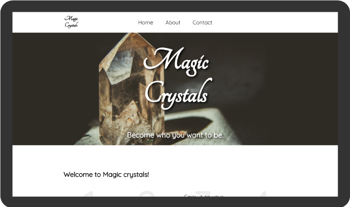
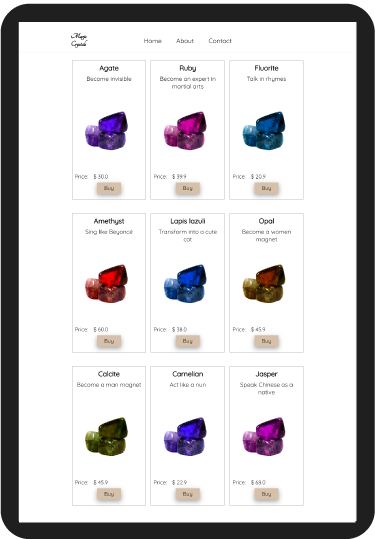
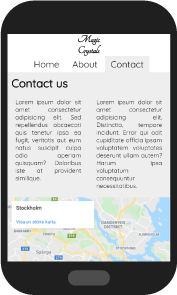

# Magic Crystals

This site was created as part of my training as a web developer at Chas Academy. This corresponds to my first individual assignment. The site presents the landing page of a fake boutique. It was created using solely HTML and CSS.

The site:

- is responsive
- is adaptive to different device sizes
- uses Grid and Flexbox
- follows accessibility guidelines

## Open the site

Download the `www` folder and open the `index.html` file. Or check the live version at this link:  http://enzo.zerega.chas.academy/u01-static-website/

## Screenshots

